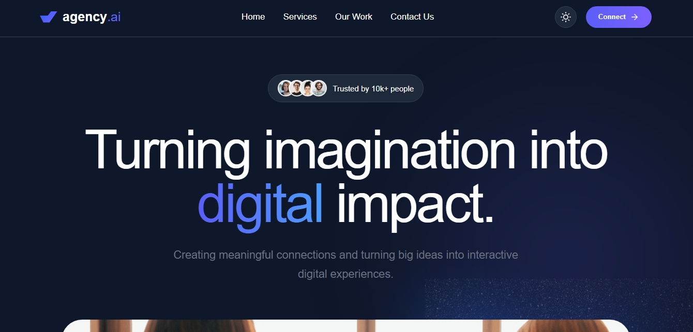

# 🚀 Agency AI

A modern and responsive AI agency website built using React.js. This project showcases AI-powered services, portfolio works, team members, and contact functionality with a clean UI/UX and smooth user experience.

🌐 Live Demo: https://agency-ai-jithanwebstack.netlify.app/

## ✨ Features

- Modern and responsive design
- Light & Dark theme support
- Smooth scrolling navigation
- Animated hero section
- Services showcase
- Portfolio / Our Work section
- Team members section
- Contact form integration
- Toast notifications
- Mobile-friendly navigation menu
- Fast and optimized performance

## 🛠️ Tech Stack

- React.js
- JavaScript
- HTML5
- CSS3
- React Hooks
- React Hot Toast
- Lucide React Icons

## 📂 Project Structure

```bash
src/
│
├── components/
│   ├── Navbar/
│   ├── Hero/
│   ├── TrustedBy/
│   ├── Services/
│   ├── OurWork/
│   ├── Teams/
│   ├── Contact/
│   └── Footer/
│
├── App.js
├── index.js
└── index.css
````

## 🚀 Installation

Clone the repository:

```bash
git clone https://github.com/Vallarasu-KSG/Agency.AI---JithanWebStack
```

Navigate to the project folder:

```bash
cd agency-ai
```

Install dependencies:

```bash
npm install
```

Run the development server:

```bash
npm start
```

Build for production:

```bash
npm run build
```

## 📱 Responsive Design

The website is fully responsive and works seamlessly across:

* Desktop
* Laptop
* Tablet
* Mobile Devices



A modern and responsive AI agency website built using React.js.

## 🎯 Purpose

This project was developed to showcase modern AI agency services with a professional and engaging user interface. It demonstrates frontend development skills, responsive web design, component-based architecture, and user-friendly interactions.

## 👨‍💻 Author

**Vallarasu K - JithanWebStack**

* Portfolio: [https://kvallarasu.space/](https://kvallarasu.space/)
* GitHub: [https://github.com/Vallarasu-KSG/](https://github.com/Vallarasu-KSG/)

## 📄 License

This project is open-source and available under the MIT License.

---

⭐ If you like this project, don't forget to star the repository!